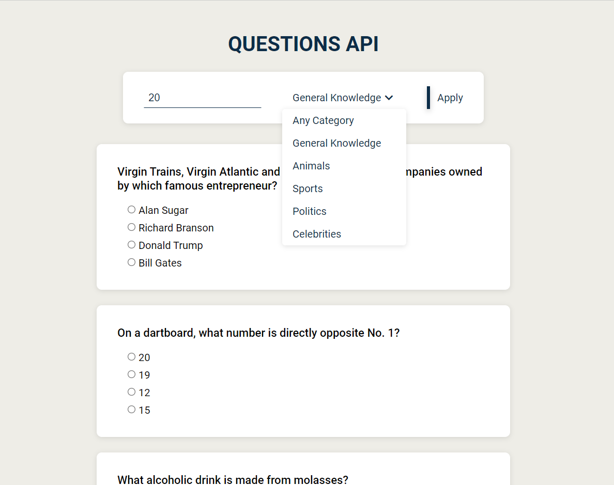

# QUESTIONS API

API de questões. Permite o usuário escolher o número (max.30) e a categoria  das questões. Ao responder todas as questões o aplicativo mostra o resultado das respostas.

API: <https://opentdb.com/>
